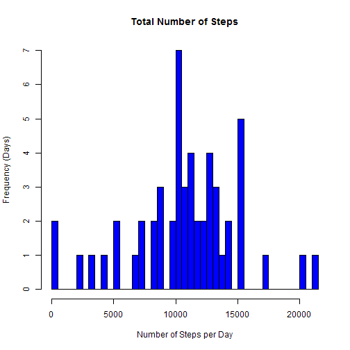
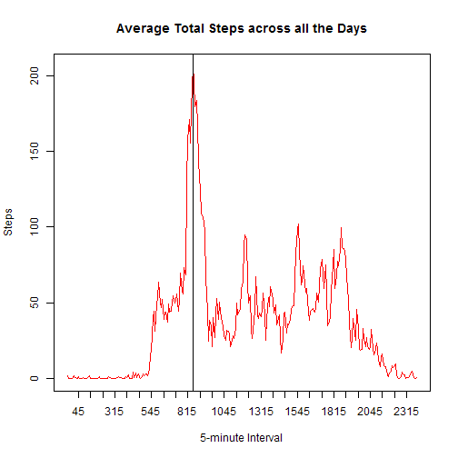
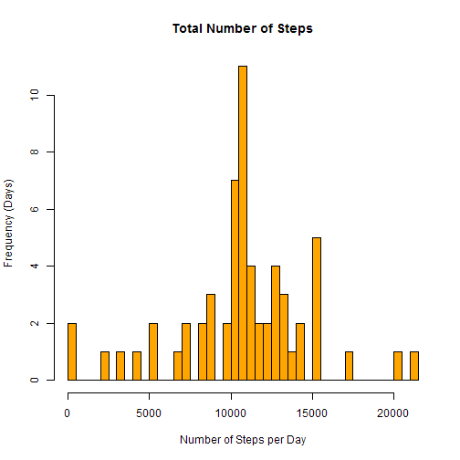
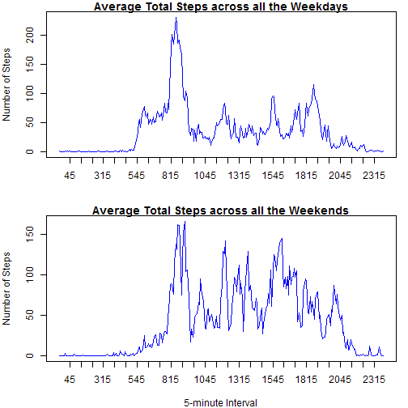

Project 1
==========================


**Load and transform data**

```r
##1
df<-read.csv("activity.csv", sep=",", header=TRUE,colClasses=c(steps="numeric", date="character",interval="numeric"))
##2
library(lubridate)
df$date<-ymd(df$date)
good<-complete.cases(df)
d<-df[good,]
```
**Steps taken per day**

```r
##1
ds<-tapply(d$steps,d$date,sum)
##2
hist(ds,xlab="Number of Steps per Day",ylab= "Frequency (Days)",breaks=50,col="blue",main="Total Number of Steps")
```

 

```r
##3
mean(ds)
```

[1] 10766.19

```r
median(ds)
```

[1] 10765
**Average daily activity pattern**

```r
##1
di<-tapply(d$steps,d$interval,mean)
intvl<-names(di[seq(0,288,10)])

plot(di,axes=F,frame=T,main="Average Total Steps across all the Days",xlab="5-minute Interval",ylab="Steps",col="red",typ="l")
axis(1,at=seq(10,280,10),labels=c(intvl))
axis(2,)
abline(v=which(di==max(di)))
```

 

```r
##2
names(which(di==max(di)))
```

[1] "835"
**Imputing missing values**

```r
##1
sum(is.na(df))
```

[1] 2304

```r
##2
di<-tapply(d$steps,d$interval,mean)
##3
dnew<-df
for (i in (1:nrow(dnew))){
  if (is.na(dnew[i,1])){
    x<-dnew[i,3]
    dnew[i,1]<-di[names(di)==x]
                  }
}
##4
ds_new<-tapply(dnew$steps,dnew$date,sum)

hist(ds_new,xlab="Number of Steps per Day",ylab= "Frequency (Days)",breaks=50,col="orange",main="Total Number of Steps")
```

 

```r
print ("Central tendancy Without imputing...")
```

[1] "Central tendancy Without imputing..."

```r
mean(ds)
```

[1] 10766.19

```r
median(ds)
```

[1] 10765

```r
print ("Central tendancy with imputing...")
```

[1] "Central tendancy with imputing..."

```r
mean(ds_new)
```

[1] 10766.19

```r
median(ds_new)
```

[1] 10766.19
**Activity patterns between weekdays and weekends**

```r
##1
dnew[,4]<-"weekday"

for (i in 1:nrow(dnew)){
  if(weekdays(dnew[i,2])=="Saturday"|weekdays(dnew[i,2])=="Sunday"){
    dnew[i,4]="weekend"}
  }
##2
library(dplyr)
dwd<-filter(dnew,V4=="weekday")
dwe<-filter(dnew,V4=="weekend")
di_wd<-tapply(dwd$steps,dwd$interval,mean)
di_wn<-tapply(dwe$steps,dwe$interval,mean)

par(mfrow=c(2,1),mar = c(4, 4, 1, 1), oma = c(0, 0, 0, 0))
plot(di_wd,axes=F,frame=T,main="Average Total Steps across all the Weekdays",xlab="",ylab="Number of Steps",col="blue",typ="l")
axis(1,at=seq(10,280,10),labels=c(intvl))
axis(2,)

plot(di_wn,axes=F,frame=T,main="Average Total Steps across all the Weekends",xlab="5-minute Interval",ylab="Number of Steps",col="blue",typ="l")
axis(1,at=seq(10,280,10),labels=c(intvl))
axis(2,)
```

 
